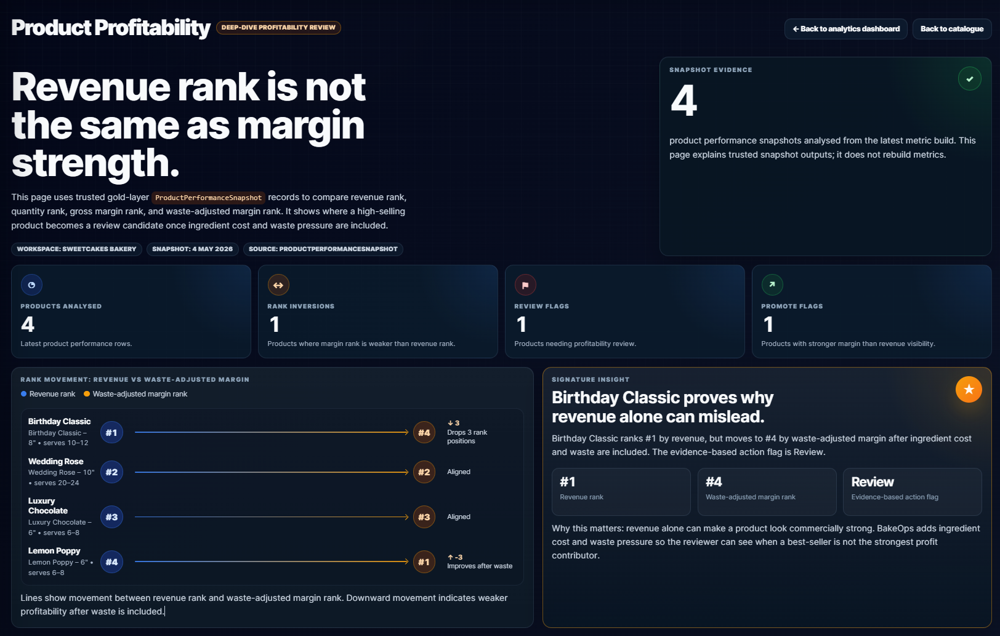
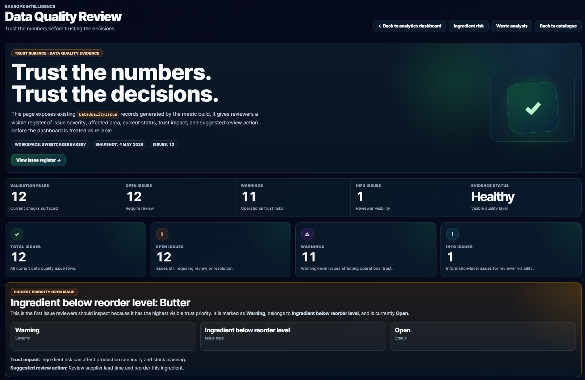
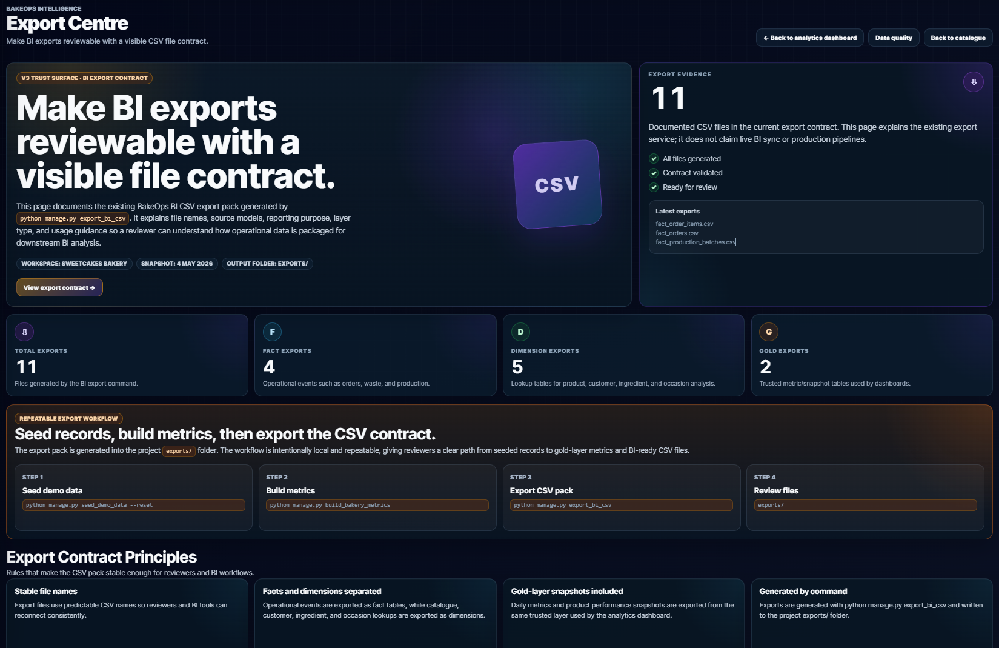
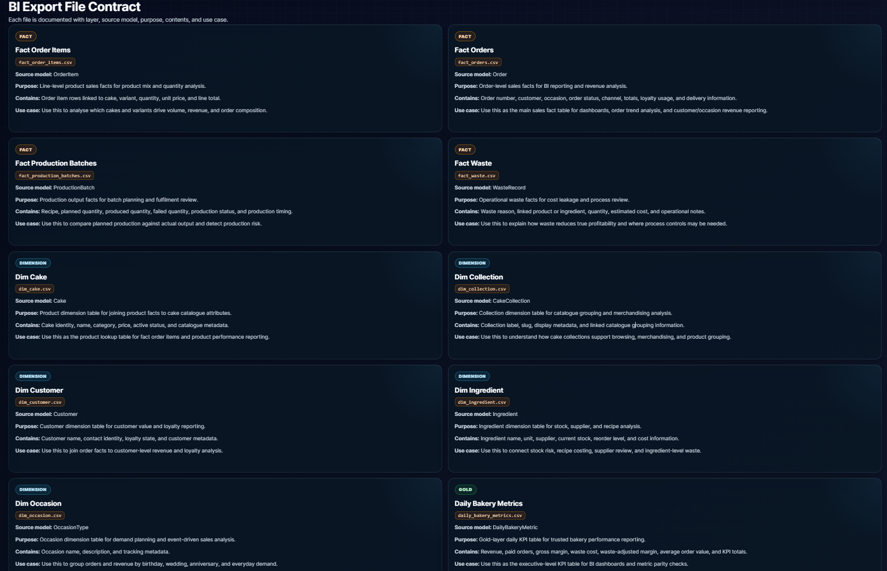

# BakeOps Intelligence


> **A Django-based bakery operations intelligence platform that turns seeded operational records into trusted KPI dashboards, profitability analysis, ingredient-risk visibility, waste analysis, data-quality review, and BI-ready CSV exports.**

Built as a **portfolio-grade commercial foundation** for Analytics Engineer, Data Engineer, and Data Analyst roles — demonstrating a complete analytics workflow from raw operational data through metric governance, gold-layer snapshots, and reviewer-verifiable evidence.

---

## Why This Project Exists

Small bakery operators can look profitable on revenue while still losing margin through waste, recipe cost, stock shortages, production mismatch, and weak data quality. BakeOps Intelligence turns those operational records into a decision-support layer that makes the numbers inspectable before a dashboard is trusted.

The project is intentionally scoped as a **trusted analytics foundation**, not a falsely launched SaaS product. Commercial readiness is documented. Live integrations, billing, production deployment, and real customer usage are not claimed.

---

## Business Questions Answered

- Which products look successful by revenue but weaken after waste-adjusted margin?
- Which ingredients create stock, reorder, or near-expiry risk?
- Which waste patterns reduce profitability?
- Which occasions drive demand and delivery pressure?
- Which customers contribute repeat value and revenue concentration?
- Which data-quality issues must be visible before trusting dashboard outputs?
- Which CSV files are available for BI and reporting workflows?

---

## Portfolio Positioning

BakeOps Intelligence is positioned as a portfolio-grade analytics engineering project for roles that require both technical data workflow discipline and business-facing analytics delivery.

| Target Role | Evidence in This Project |
|---|---|
| Analytics Engineer | Gold-layer snapshots, metric governance, lineage, data-quality visibility, and dashboard-ready analytical models |
| Data Engineer | Repeatable seed/build/export workflow, BI-ready CSV contracts, fact/dimension exports, and reproducible command-driven outputs |
| Data Analyst | Product profitability analysis, waste impact, ingredient risk, customer value, occasion demand, and business recommendation surfaces |
| Python / Django Data Product Developer | Django models, views, templates, management commands, tests, CI, and a polished analytics interface |

---

## Signature Insight

The core business idea this platform proves:

> **The highest-revenue product is not necessarily the strongest product once ingredient cost and waste pressure are included.**

| Product | Revenue Rank | Waste-adjusted Margin Rank | Action |
|---|:---:|:---:|---|
| Birthday Classic | #1 | #4 | Review |

Verify directly after setup:

```powershell
python manage.py shell -c "from bakeops.models import ProductPerformanceSnapshot; p=ProductPerformanceSnapshot.objects.get(cake__name='Birthday Classic'); print(p.cake.name, p.revenue_rank, p.waste_adjusted_margin_rank, p.action_flag)"
```

Expected:

```text
Birthday Classic 1 4 review
```

---

## What Reviewers Should Notice

- The project does not stop at visual dashboards — it builds stored gold-layer snapshots before rendering any analytics page.
- Product profitability is decision-oriented: revenue rank, gross margin, waste-adjusted margin, rank movement, and action flags are shown together so the gap between revenue performance and true margin strength is visible.
- Ingredient, waste, occasion, and customer pages translate operational records into reviewable business questions, not just data tables.
- Data-quality issues remain visible before metrics are treated as trustworthy — the dashboard is not the source of truth, the stored snapshots are.
- The Export Centre documents CSV outputs as a named BI file contract with source models and layer types, rather than an undocumented download feature.
- The README separates implemented evidence from future SaaS opportunities, protecting credibility and avoiding exaggerated claims.

---

## Visual Evidence

The screenshots below follow the complete analytics flow: command centre → profitability insight → ingredient risk → waste impact → occasion demand → customer value → data quality → BI export contract.

### 1. Dashboard


---

### 2. Product Profitability



---

### 4. Waste Analysis


---

### 5. Occasion Analytics


---

### 6. Customer Analytics


---

### 7. Data Quality Review



---

### 8. Export Centre



<details>
<summary>Export workflow and file contract table</summary>




</details>

---

## LinkedIn Screenshot Subset

For a LinkedIn carousel, use this six-slide sequence:

| Slide | Screenshot | Story |
|:---:|---|---|
| 1 | `01_dashboard_command_centre.png` | Platform credibility and command-centre view |
| 2 | `03_product_profitability_top.png` | Strongest commercial insight |
| 3 | `06_ingredient_risk_top.png` | Operational risk and production-readiness |
| 4 | `09_waste_analysis_top.png` | Waste and margin-control story |
| 5 | `18_data_quality_review_top.png` | Trust and governance |
| 6 | `21_export_centre_top.png` | BI and export-readiness |

---

## Tech Stack

| Layer | Technology |
|---|---|
| Framework | Django 5.2 |
| Language | Python 3.11+ |
| Database | SQLite (local development) |
| Analytics | Custom gold-layer metric build pipeline |
| Exports | CSV via Django management commands |
| Tests | Django test runner — 37 tests |
| CI | GitHub Actions |
| Linting | Ruff |

---

## Quick Start

```powershell
python -m venv .venv
.\.venv\Scripts\activate
python -m pip install --upgrade pip
python -m pip install -r requirements.txt
copy .env.example .env
python manage.py migrate
python manage.py seed_demo_data --reset
python manage.py build_bakery_metrics
python manage.py runserver
```

Open:

```text
http://127.0.0.1:8000/analytics/
```

---

## Analytics Workflow

```text
python manage.py seed_demo_data --reset
→ Creates seeded bakery operations records

python manage.py build_bakery_metrics
→ Creates gold-layer snapshots and data-quality issues

python manage.py export_bi_csv
→ Generates 11 BI-ready CSV files (52 rows)

Analytics pages
→ Read stored operational and gold-layer data
→ The dashboard is not the source of truth — stored snapshots are the reviewable evidence layer
```

---

## Analytics Pages

| Page | URL | Purpose |
|---|---|---|
| Dashboard | `/analytics/` | KPI overview, command-centre workflow, signature insight, recommended actions |
| Product Profitability | `/analytics/products/` | Revenue rank vs waste-adjusted margin rank, inversions, action flags |
| Ingredient Risk | `/analytics/ingredients/` | Stock levels, reorder pressure, near-expiry lots, recommendations |
| Waste Analysis | `/analytics/waste/` | Waste cost by reason and product, margin reduction visibility |
| Occasion Analytics | `/analytics/occasions/` | Occasion demand, upcoming order pressure, delivery risk |
| Customer Analytics | `/analytics/customers/` | Revenue, repeat behaviour, average order value, loyalty |
| Data Quality Review | `/analytics/data-quality/` | Open issues, severity, trust impact, suggested review action |
| Export Centre | `/analytics/exports/` | BI export file contract, source models, usage guidance |

---

## Key Features

### Operations and Analytics

- Seeded bakery operations dataset covering workspace, customers, loyalty, occasions, orders, ingredients, recipes, production, allocation, and waste
- Gold-layer analytics models built from operational data
- Repeatable metric build command with run logging and audit trail
- Product profitability analysis with revenue rank, gross margin, waste-adjusted margin, and action flags
- Ingredient risk analysis with stock, usage, waste, reorder pressure, and expiry pressure
- Waste analysis with margin impact breakdown by reason and by product
- Occasion demand and delivery pressure analysis
- Customer loyalty and revenue concentration analytics
- Data-quality issue generation, severity classification, and trust visibility
- 11 BI-ready CSV exports across fact, dimension, and gold layers

### Trust and Reviewability

- Metric governance documentation
- Data lineage from seeded records to analytics pages and BI exports
- Data-quality issue visibility before dashboard outputs are trusted
- Export file contract with source model documentation
- Reviewer walkthrough with expected output at each step
- 37 tests covering commands, services, views, and export parity
- GitHub Actions CI

### Commercial Readiness Documentation

- Product strategy, commercial scope, and honest product-boundary documentation
- Import readiness assessment and draft import contract
- Demo setup and first-customer setup workflow
- Beta-readiness evidence and deployment-readiness checklist
- Packaging and pricing strategy

---

## BI Export Contract

```powershell
python manage.py export_bi_csv
```

Expected output:

```text
BakeOps BI CSV exports generated successfully.
Files generated: 11
Total rows exported: 52
```

| File | Layer | Purpose |
|---|---|---|
| `fact_orders.csv` | Fact | Order-level fact table |
| `fact_order_items.csv` | Fact | Order item fact table |
| `fact_waste.csv` | Fact | Waste fact table |
| `fact_production_batches.csv` | Fact | Production batch fact table |
| `dim_cake.csv` | Dimension | Cake and product dimension |
| `dim_ingredient.csv` | Dimension | Ingredient dimension |
| `dim_customer.csv` | Dimension | Customer and loyalty dimension |
| `dim_occasion.csv` | Dimension | Occasion dimension |
| `dim_collection.csv` | Dimension | Cake collection dimension |
| `daily_bakery_metrics.csv` | Gold | Daily KPI gold-layer export |
| `product_performance_snapshot.csv` | Gold | Product profitability gold-layer export |

Generated CSV files are intentionally excluded from Git — reproducible from seeded data and the metric build pipeline.

---

## Data Quality Visibility

BakeOps does not hide trust issues. The metric build creates `DataQualityIssue` records when operational data requires review. The data quality page surfaces severity, issue type, status, affected area, trust impact, and suggested review action.

Current seeded demo evidence:

```text
Total issues: 12   |   Open: 12   |   Warnings: 11   |   Info: 1
```

---

## Reviewer Verification Flow

```powershell
git status
python -m ruff check .
python manage.py check
python manage.py makemigrations --check --dry-run
python manage.py test
python manage.py seed_demo_data --reset
python manage.py build_bakery_metrics
python manage.py export_bi_csv
python manage.py shell -c "from bakeops.models import ProductPerformanceSnapshot; p=ProductPerformanceSnapshot.objects.get(cake__name='Birthday Classic'); print(p.cake.name, p.revenue_rank, p.waste_adjusted_margin_rank, p.action_flag)"
python manage.py runserver
```

Expected output:

```text
All checks passed!
System check identified no issues (0 silenced)
No changes detected
Ran 37 tests — OK
BakeOps demo data seeded successfully.
BakeOps bakery metrics built successfully.
BakeOps BI CSV exports generated successfully.
Birthday Classic 1 4 review
```

Route check:

```powershell
python manage.py shell -c "from django.test import Client; c=Client(); routes=['/analytics/','/analytics/products/','/analytics/ingredients/','/analytics/waste/','/analytics/occasions/','/analytics/customers/','/analytics/data-quality/','/analytics/exports/']; [print(r, c.get(r).status_code) for r in routes]"
```

Expected:

```text
/analytics/ 200         /analytics/waste/ 200
/analytics/products/ 200     /analytics/occasions/ 200
/analytics/ingredients/ 200   /analytics/customers/ 200
/analytics/data-quality/ 200  /analytics/exports/ 200
```

---

## Honest Scope Boundary

BakeOps Intelligence is a credible commercial foundation. It does not claim capabilities that have not been built.

| Area | Status |
|---|---|
| Trusted analytics pages | Implemented |
| Gold-layer metric build | Implemented |
| Data quality visibility | Implemented |
| BI-ready CSV exports | Implemented |
| Tests and CI | Implemented |
| Screenshot evidence | Implemented |
| Commercial product positioning | Documented |
| Import readiness | Documented |
| Demo and customer setup workflow | Documented |
| Deployment-readiness checklist | Documented |
| Packaging and pricing strategy | Documented |
| External POS integration | Not implemented |
| Shopify / Square integration | Not implemented |
| Billing and subscriptions | Not implemented |
| Automated onboarding | Not implemented |
| Multi-tenant SaaS account management | Not implemented |
| Production SaaS deployment | Not claimed |
| Real customer usage | Not claimed |

This boundary is deliberate. The project prioritises evidence, verification, and honest portfolio positioning over exaggerated claims.

---

## Platform Architecture

| App | Purpose |
|---|---|
| `cakes` | Customer-facing cake catalogue and related static assets |
| `bakeops` | Analytics, operations, metrics, data quality, exports, and decision intelligence |

```text
Seeded demo records
→ Operational models
→ Metric build command
→ Gold-layer analytics models
→ Analytics views and dashboards
→ CSV export service
→ Reviewer documentation and screenshot evidence
```

---

## Data Model

**Operational layer** — `Workspace` · `StaffMember` · `Customer` · `LoyaltyAccount` · `CakeReview` · `OccasionType` · `DeliverySlot` · `BakeryOrder` · `BakeryOrderItem` · `Supplier` · `Ingredient` · `IngredientLot` · `Recipe` · `RecipeLine` · `ProductionBatch` · `ProductionBatchLine` · `BatchAllocation` · `WasteRecord`

**Gold-layer analytics** — `DailyBakeryMetric` · `ProductPerformanceSnapshot` · `IngredientUsageSnapshot` · `OccasionDemandSnapshot` · `CustomerLoyaltySnapshot` · `BakeryMetricRunLog` · `DataQualityIssue`

---

## Metric Governance

| Output | Purpose |
|---|---|
| `DailyBakeryMetric` | Daily KPI summary |
| `ProductPerformanceSnapshot` | Revenue, margin, waste-adjusted margin, ranking, action flag |
| `IngredientUsageSnapshot` | Usage, waste, stock risk, expiry pressure |
| `OccasionDemandSnapshot` | Demand, revenue, upcoming orders, delivery pressure |
| `CustomerLoyaltySnapshot` | Revenue, order count, AOV, loyalty points, repeat status |
| `DataQualityIssue` | Operational trust issues requiring review |
| `BakeryMetricRunLog` | Build audit trail: rows processed, timing, status, errors |

Full detail: `docs/METRIC_GOVERNANCE.md` · `docs/LINEAGE.md`

---

## Status

| Stage | Description | Status |
|---|---|---|
| V1 | Working analytics dashboard from seeded operational data | Complete |
| V2 | Trusted analytics, metric governance, lineage, data quality, exports, tests, CI | Complete |
| V3 | Commercial-readiness foundation with honest product boundaries | Complete |
| Future Enhancement Track | Imports, onboarding, deployment planning, commercial SaaS extensions | Planned |

---

## Documentation Map

| Document | Purpose |
|---|---|
| `docs/REVIEWER_WALKTHROUGH.md` | Reviewer path for running and validating the project |
| `docs/METRIC_GOVERNANCE.md` | Metric build process, gold-layer snapshots, run logging |
| `docs/LINEAGE.md` | Data lineage from seeded records to analytics pages and BI exports |
| `docs/V3_PRODUCT_STRATEGY.md` | Commercial product strategy and first-user framing |
| `docs/V3_COMMERCIAL_SCOPE.md` | Safe commercial claims and scope boundaries |
| `docs/V3_BETA_READINESS.md` | Beta-readiness evidence and remaining gaps |
| `docs/V3_DEPLOYMENT_READINESS_CHECKLIST.md` | Deployment-readiness checklist |
| `docs/V3_PACKAGING_PRICING_STRATEGY.md` | Packaging and pricing strategy |

Additional documents covering import readiness, demo workflow, customer setup, data model, and release checklists are available in `docs/`.

---

## Current Limitations

- External POS imports
- Shopify, Square, Stripe, or payment integrations
- Live production scheduling integrations
- Automated customer onboarding flows
- Multi-tenant SaaS account management
- Billing or subscriptions
- Production SaaS deployment
- Real customer usage

These are future concerns and are not claimed as implemented.

---

## What This Project Demonstrates

- Django application structure and operational data modelling
- Metric build pipelines and gold-layer analytics modelling
- Decision-support dashboards with reviewer-verifiable evidence
- Data-quality checks and trust surfacing before outputs are relied upon
- BI export contracts with full file-level documentation
- Analytics engineering and data engineering discipline
- Data analyst storytelling through commercial KPI interpretation
- Honest commercial product-boundary thinking
- Demo and first-customer setup workflow planning
- Beta-readiness and deployment-readiness documentation
- Packaging and pricing strategy discipline
